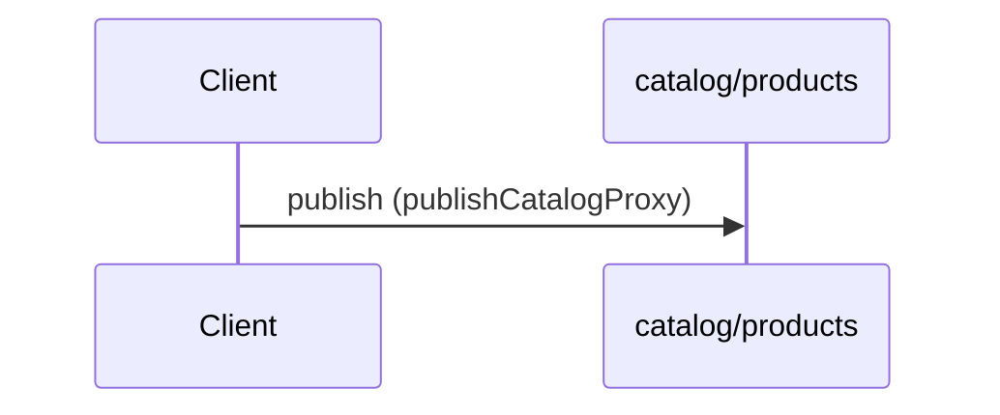

# Catalog product list events (v2 schema)

**PUBLISH** `catalog/products`



```yaml
message:
  payload:
    $ref: "../v2/asyncapi.yaml#/components/schemas/ListProductsResponse"
operationId: publishCatalogProxy
summary: Catalog product list events (v2 schema)
```

