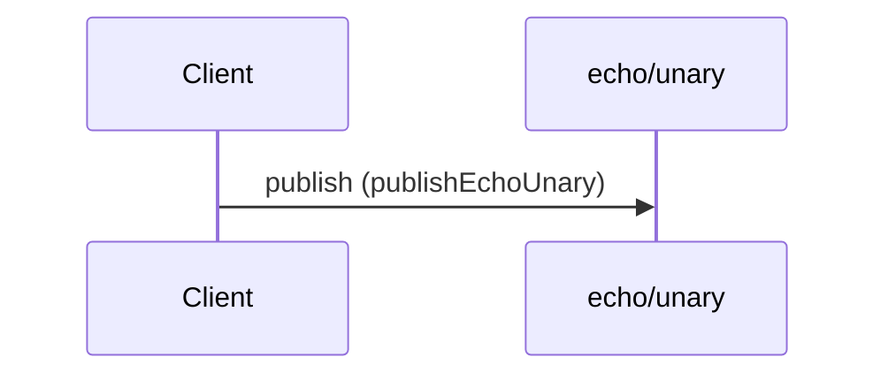

# Publish echo request

**PUBLISH** `echo/unary` — QoS 1 · `kafka` topic `acme.echo.unary`



#### Messages

- [EchoUnaryRequest](../message/EchoUnaryRequest.md)

```yaml
message:
  $ref: "#/components/messages/EchoUnaryRequest"
operationId: publishEchoUnary
summary: Publish echo request
```

