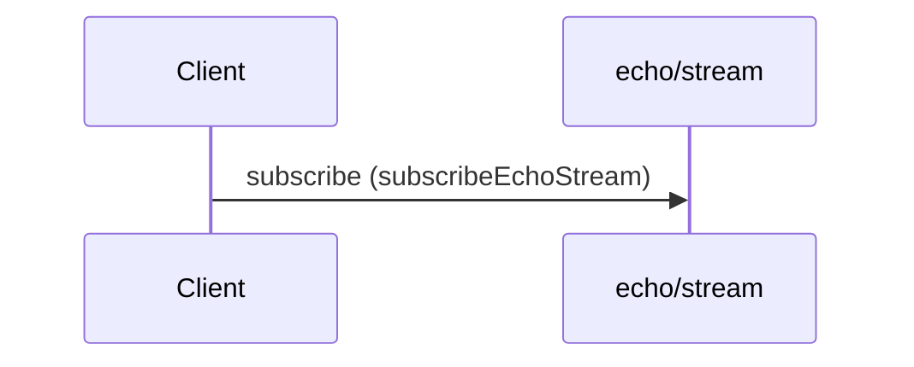

# Stream echo chunks

**SUBSCRIBE** `echo/stream` — `kafka` topic `acme.echo.stream`



#### Messages

- [EchoStreamChunk](../message/EchoStreamChunk.md)

```yaml
message:
  $ref: "#/components/messages/EchoStreamChunk"
operationId: subscribeEchoStream
summary: Stream echo chunks
```

