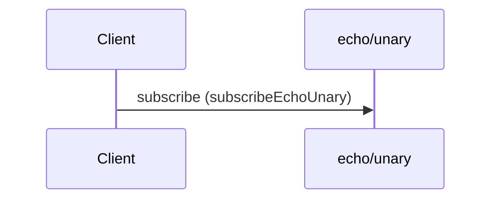

# Receive echo response

**SUBSCRIBE** `echo/unary` — QoS 1 · `kafka` topic `acme.echo.unary`



#### Messages

- [EchoUnaryResponse](../message/EchoUnaryResponse.md)

```yaml
message:
  $ref: "#/components/messages/EchoUnaryResponse"
operationId: subscribeEchoUnary
summary: Receive echo response
```

