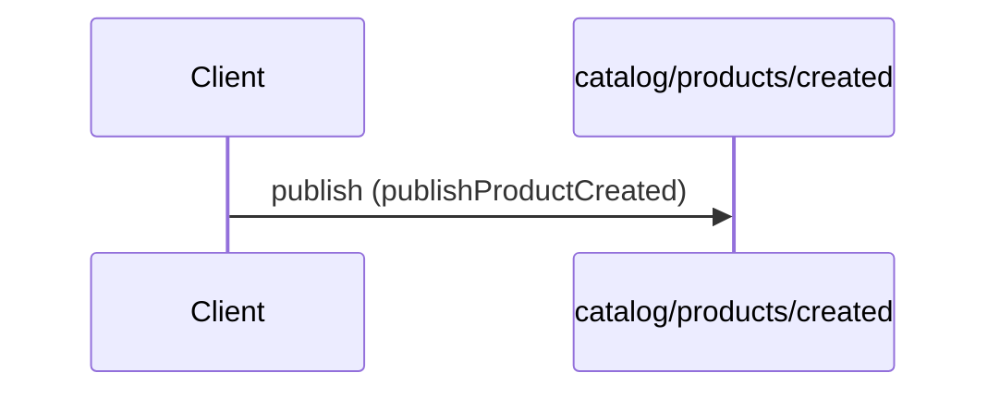

# Product created event

**PUBLISH** `catalog/products/created` — `kafka` topic `acme.catalog.products.created`



```yaml
message:
  $ref: "#/components/messages/ProductCreated"
operationId: publishProductCreated
summary: Product created event
tags:
- catalog
```

