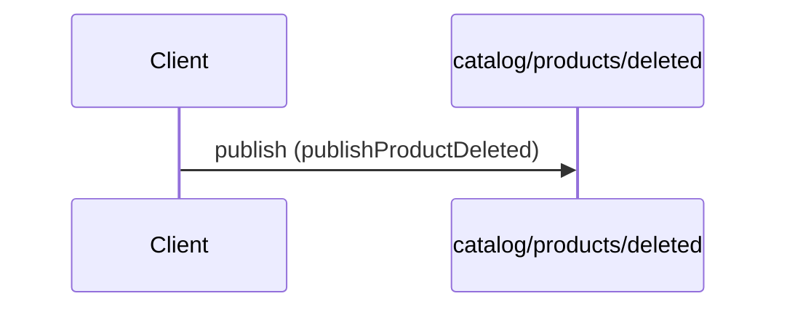

# Product deleted event

**PUBLISH** `catalog/products/deleted` — `kafka` topic `acme.catalog.products.deleted`



#### Messages

- [ProductDeleted](../message/ProductDeleted.md)

```yaml
message:
  $ref: "#/components/messages/ProductDeleted"
operationId: publishProductDeleted
summary: Product deleted event
tags:
- catalog
```

