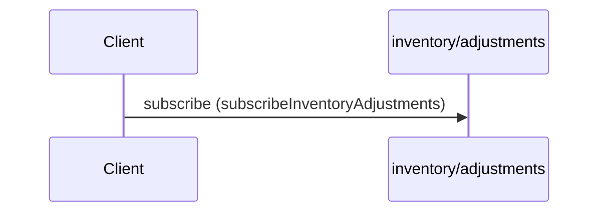

# Stream inventory adjustments

**SUBSCRIBE** `inventory/adjustments` — `kafka` topic `acme.inventory.adjustments`



```yaml
message:
  $ref: "#/components/messages/InventoryAdjustmentEvent"
operationId: subscribeInventoryAdjustments
summary: Stream inventory adjustments
tags:
- inventory
```

