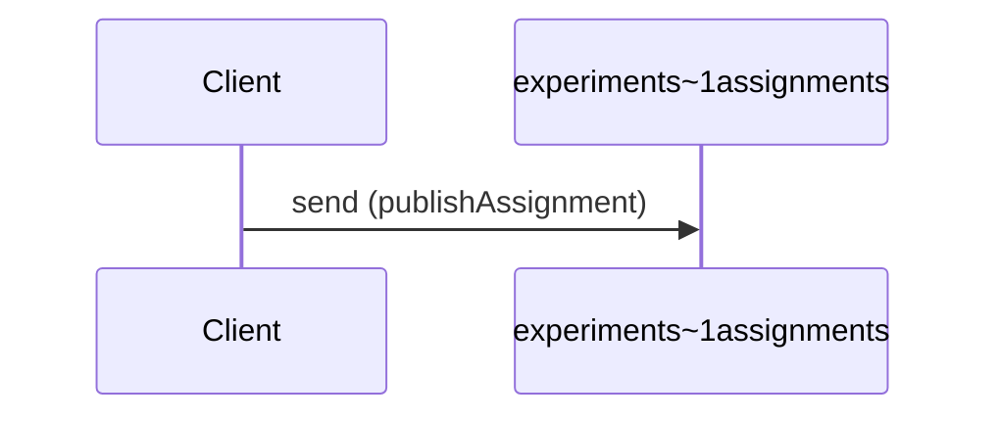

# Publish experiment assignment

**SEND** `experiments~1assignments`



```yaml
action: send
channel:
  $ref: "#/channels/experiments~1assignments"
messages:
- $ref: "#/channels/experiments~1assignments/messages/assignmentCreated"
summary: Publish experiment assignment
```

