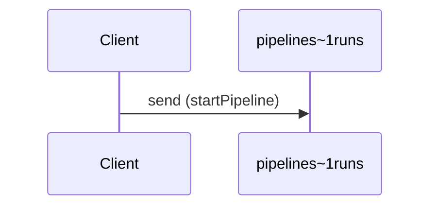

# Start a pipeline run

**SEND** `pipelines~1runs`



```yaml
action: send
bindings:
  kafka:
    bindingVersion: 0.5.0
    groupId: pipeline-producers
channel:
  $ref: "#/channels/pipelines~1runs"
messages:
- $ref: "#/channels/pipelines~1runs/messages/pipelineStarted"
summary: Start a pipeline run
```

