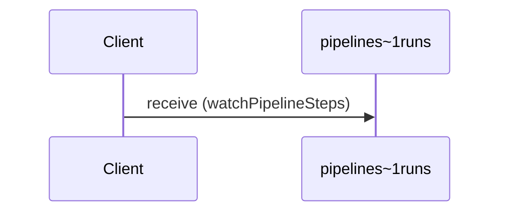

# Watch pipeline step completions

**RECEIVE** `pipelines~1runs`



```yaml
action: receive
bindings:
  kafka:
    bindingVersion: 0.5.0
    groupId: pipeline-watchers
channel:
  $ref: "#/channels/pipelines~1runs"
messages:
- $ref: "#/channels/pipelines~1runs/messages/pipelineStepCompleted"
summary: Watch pipeline step completions
```

