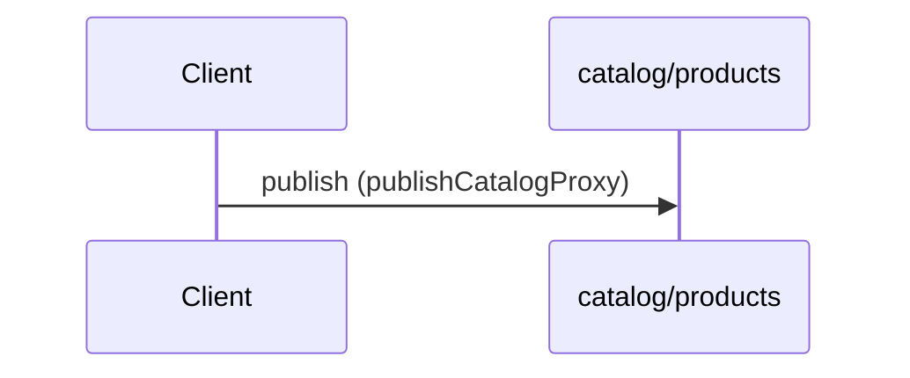
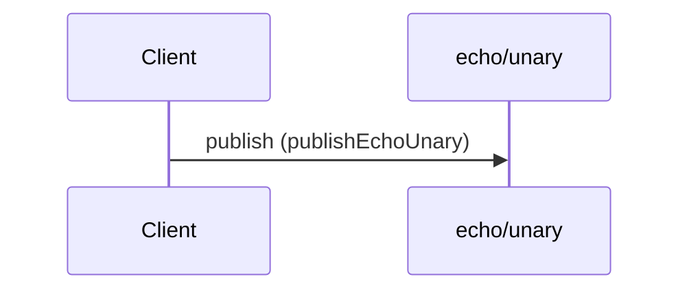
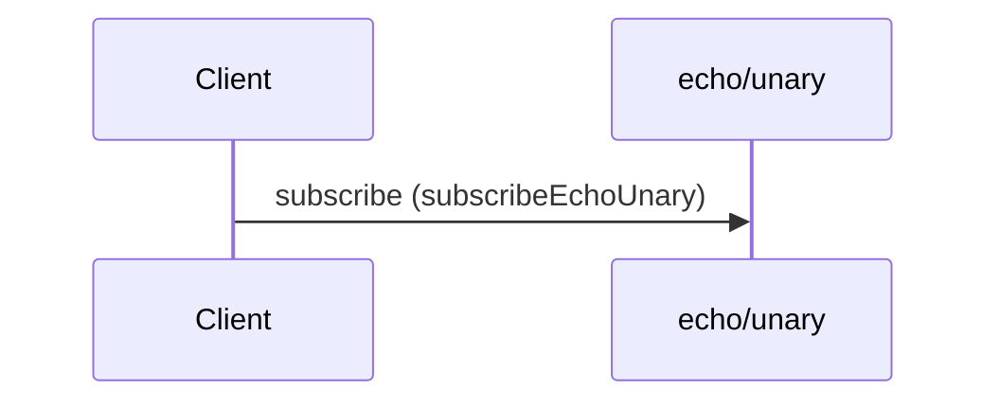
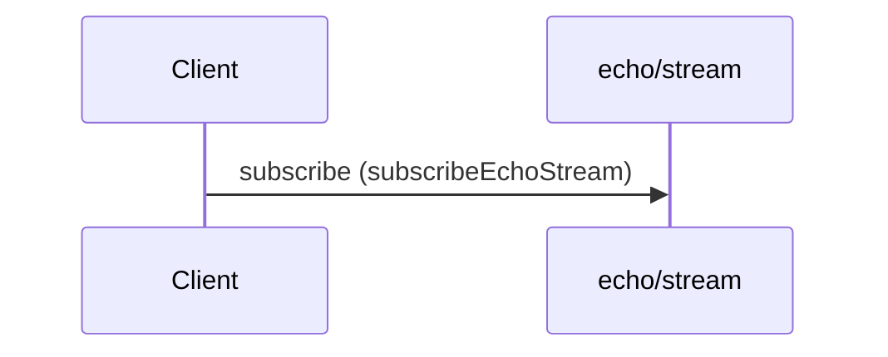

# acme.example.v1

Echo and gateway events for the Acme documentation fixture.


## Channels

### catalog/products

**channel** `catalog/products`

```yaml
publish:
  message:
    payload:
      $ref: "../v2/asyncapi.yaml#/components/schemas/ListProductsResponse"
  operationId: publishCatalogProxy
  summary: Catalog product list events (v2 schema)
```

### echo/stream

**channel** `echo/stream`

Server-sent echo chunks as an event stream.

#### Messages

- [EchoStreamChunk](#echostreamchunk)

```yaml
bindings:
  kafka:
    bindingVersion: 0.4.0
    partitions: 3
    topic: acme.echo.stream
description: Server-sent echo chunks as an event stream.
subscribe:
  message:
    $ref: "#/components/messages/EchoStreamChunk"
  operationId: subscribeEchoStream
  summary: Stream echo chunks
```

### echo/unary

**channel** `echo/unary`

Echo unary request/response as events.

#### Messages

- [EchoUnaryRequest](#echounaryrequest)
- [EchoUnaryResponse](#echounaryresponse)

```yaml
bindings:
  kafka:
    bindingVersion: 0.4.0
    partitions: 6
    replicas: 3
    topic: acme.echo.unary
  mqtt:
    bindingVersion: 0.2.0
    qos: 1
    retain: false
description: Echo unary request/response as events.
publish:
  message:
    $ref: "#/components/messages/EchoUnaryRequest"
  operationId: publishEchoUnary
  summary: Publish echo request
subscribe:
  message:
    $ref: "#/components/messages/EchoUnaryResponse"
  operationId: subscribeEchoUnary
  summary: Receive echo response
```

## Operations

### Catalog product list events (v2 schema)

**PUBLISH** `catalog/products`



```yaml
message:
  payload:
    $ref: "../v2/asyncapi.yaml#/components/schemas/ListProductsResponse"
operationId: publishCatalogProxy
summary: Catalog product list events (v2 schema)
```

### Publish echo request

**PUBLISH** `echo/unary` — QoS 1 · `kafka` topic `acme.echo.unary`



#### Messages

- [EchoUnaryRequest](#echounaryrequest)

```yaml
message:
  $ref: "#/components/messages/EchoUnaryRequest"
operationId: publishEchoUnary
summary: Publish echo request
```

### Receive echo response

**SUBSCRIBE** `echo/unary` — QoS 1 · `kafka` topic `acme.echo.unary`



#### Messages

- [EchoUnaryResponse](#echounaryresponse)

```yaml
message:
  $ref: "#/components/messages/EchoUnaryResponse"
operationId: subscribeEchoUnary
summary: Receive echo response
```

### Stream echo chunks

**SUBSCRIBE** `echo/stream` — `kafka` topic `acme.echo.stream`



#### Messages

- [EchoStreamChunk](#echostreamchunk)

```yaml
message:
  $ref: "#/components/messages/EchoStreamChunk"
operationId: subscribeEchoStream
summary: Stream echo chunks
```

## Messages

### EchoStreamChunk

```yaml
name: EchoStreamChunk
payload:
  $ref: "#/components/schemas/EchoStreamChunk"
title: Echo stream chunk
```

### EchoUnaryRequest

```yaml
name: EchoUnaryRequest
payload:
  $ref: "#/components/schemas/EchoUnaryRequest"
title: Echo unary request
```

### EchoUnaryResponse

```yaml
name: EchoUnaryResponse
payload:
  $ref: "#/components/schemas/EchoUnaryResponse"
title: Echo unary response
```

## Schemas

### EchoStreamChunk

```yaml
properties:
  payload:
    type: string
  sequence:
    type: integer
type: object
```

### EchoUnaryRequest

```yaml
properties:
  locale:
    type: string
  message:
    type: string
required:
- message
type: object
```

### EchoUnaryResponse

```yaml
properties:
  echoed_at:
    format: date-time
    type: string
  message:
    type: string
type: object
```

### Problem

```yaml
$ref: "../shared/schemas.yaml#/Problem"
```

