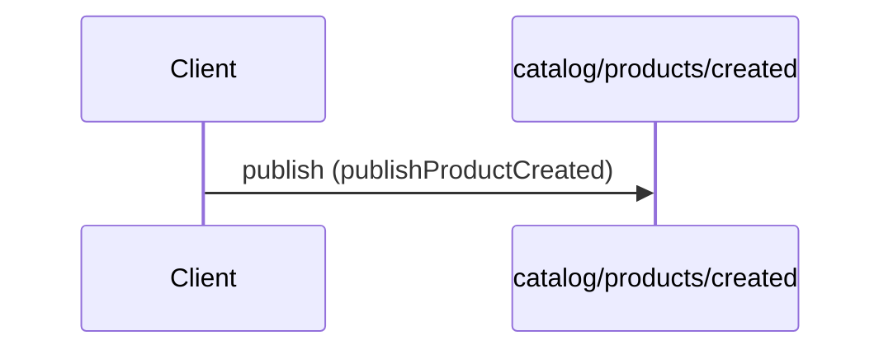
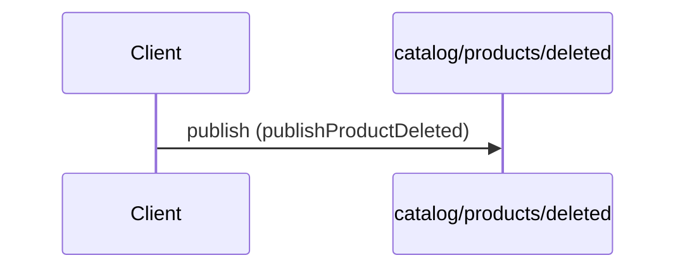
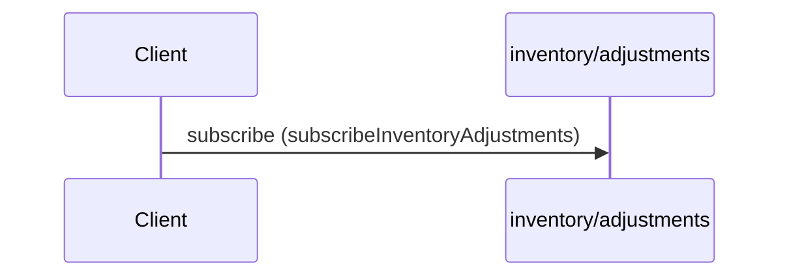

# acme.example.v2

Catalog and inventory event streams for the Acme fixture.


## Channels

### catalog/products/created

**channel** `catalog/products/created`

```yaml
bindings:
  kafka:
    bindingVersion: 0.4.0
    partitions: 12
    topic: acme.catalog.products.created
publish:
  message:
    $ref: "#/components/messages/ProductCreated"
  operationId: publishProductCreated
  summary: Product created event
  tags:
  - catalog
tags:
- name: catalog
```

### catalog/products/deleted

**channel** `catalog/products/deleted`

```yaml
bindings:
  kafka:
    bindingVersion: 0.4.0
    topic: acme.catalog.products.deleted
publish:
  message:
    $ref: "#/components/messages/ProductDeleted"
  operationId: publishProductDeleted
  summary: Product deleted event
  tags:
  - catalog
tags:
- name: catalog
```

### inventory/adjustments

**channel** `inventory/adjustments`

```yaml
bindings:
  kafka:
    bindingVersion: 0.4.0
    groupId: inventory-watchers
    topic: acme.inventory.adjustments
subscribe:
  message:
    $ref: "#/components/messages/InventoryAdjustmentEvent"
  operationId: subscribeInventoryAdjustments
  summary: Stream inventory adjustments
  tags:
  - inventory
tags:
- name: inventory
```

## Operations

### Product created event

**PUBLISH** `catalog/products/created` — `kafka` topic `acme.catalog.products.created`



```yaml
message:
  $ref: "#/components/messages/ProductCreated"
operationId: publishProductCreated
summary: Product created event
tags:
- catalog
```

### Product deleted event

**PUBLISH** `catalog/products/deleted` — `kafka` topic `acme.catalog.products.deleted`



```yaml
message:
  $ref: "#/components/messages/ProductDeleted"
operationId: publishProductDeleted
summary: Product deleted event
tags:
- catalog
```

### Stream inventory adjustments

**SUBSCRIBE** `inventory/adjustments` — `kafka` topic `acme.inventory.adjustments`



```yaml
message:
  $ref: "#/components/messages/InventoryAdjustmentEvent"
operationId: subscribeInventoryAdjustments
summary: Stream inventory adjustments
tags:
- inventory
```

## Messages

### InventoryAdjustmentEvent

```yaml
name: InventoryAdjustmentEvent
payload:
  $ref: "#/components/schemas/InventoryAdjustment"
```

### ProductCreated

```yaml
name: ProductCreated
payload:
  $ref: "#/components/schemas/Product"
```

### ProductDeleted

```yaml
name: ProductDeleted
payload:
  properties:
    product_id:
      format: uuid
      type: string
  type: object
```

## Schemas

### InventoryAdjustment

```yaml
properties:
  delta:
    format: int64
    type: integer
  reason:
    type: string
  sku:
    type: string
type: object
```

### Problem

```yaml
$ref: "../shared/schemas.yaml#/Problem"
```

### Product

```yaml
properties:
  display_name:
    type: string
  product_id:
    format: uuid
    type: string
required:
- product_id
- display_name
type: object
```

