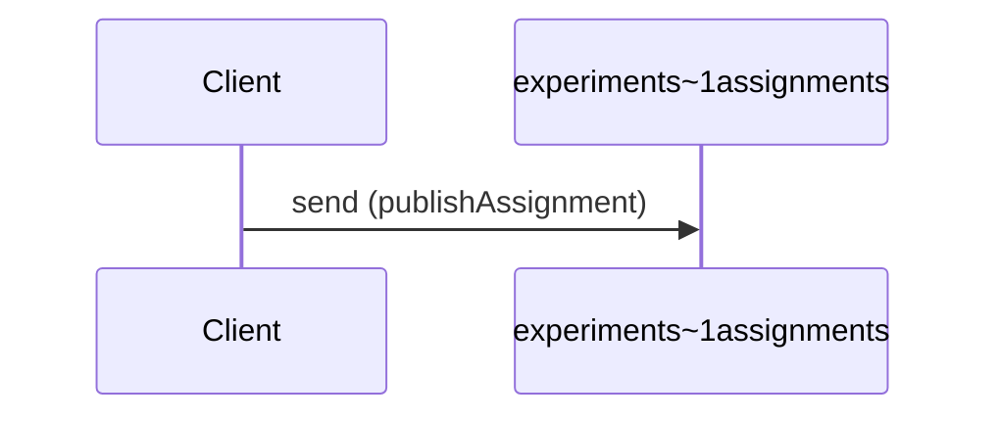
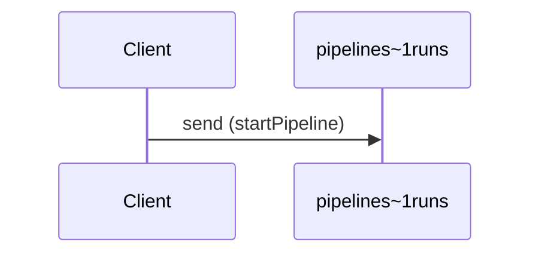
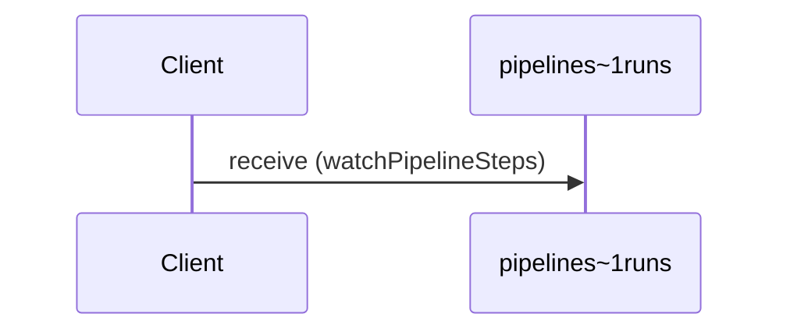

# acme.example.v3alpha1

Alpha pipeline and experiment event operations.


## Channels

### experiments/assignments

**channel** `experiments/assignments`

#### Messages

- [AssignmentCreated](#assignmentcreated)

```yaml
address: experiments/assignments
messages:
  assignmentCreated:
    $ref: "#/components/messages/AssignmentCreated"
```

### pipelines/runs

**channel** `pipelines/runs`

Pipeline run lifecycle events.

#### Messages

- [PipelineStarted](#pipelinestarted)
- [PipelineStepCompleted](#pipelinestepcompleted)

```yaml
address: pipelines/runs
bindings:
  kafka:
    bindingVersion: 0.5.0
    partitions: 8
    topic: acme.pipelines.runs
description: Pipeline run lifecycle events.
messages:
  pipelineStarted:
    $ref: "#/components/messages/PipelineStarted"
  pipelineStepCompleted:
    $ref: "#/components/messages/PipelineStepCompleted"
```

## Operations

### Publish experiment assignment

**SEND** `experiments~1assignments`



```yaml
action: send
channel:
  $ref: "#/channels/experiments~1assignments"
messages:
- $ref: "#/channels/experiments~1assignments/messages/assignmentCreated"
summary: Publish experiment assignment
```

### Start a pipeline run

**SEND** `pipelines~1runs`



```yaml
action: send
bindings:
  kafka:
    bindingVersion: 0.5.0
    groupId: pipeline-producers
channel:
  $ref: "#/channels/pipelines~1runs"
messages:
- $ref: "#/channels/pipelines~1runs/messages/pipelineStarted"
summary: Start a pipeline run
```

### Watch pipeline step completions

**RECEIVE** `pipelines~1runs`



```yaml
action: receive
bindings:
  kafka:
    bindingVersion: 0.5.0
    groupId: pipeline-watchers
channel:
  $ref: "#/channels/pipelines~1runs"
messages:
- $ref: "#/channels/pipelines~1runs/messages/pipelineStepCompleted"
summary: Watch pipeline step completions
```

## Messages

### AssignmentCreated

#### Payload

- [AssignmentCreatedPayload](#assignmentcreatedpayload)

```yaml
name: AssignmentCreated
payload:
  properties:
    arm:
      type: string
    experiment_id:
      format: uuid
      type: string
    subject_id:
      type: string
  type: object
```

### PipelineStarted

```yaml
name: PipelineStarted
payload:
  schema:
    fields:
    - name: run_id
      type: string
    - name: pipeline_name
      type: string
    - name: started_at
      type: string
    name: PipelineStarted
    namespace: acme.events.v3alpha1
    type: record
  schemaFormat: application/vnd.apache.avro+json
title: Pipeline started (Avro)
```

### PipelineStepCompleted

#### Payload

- [PipelineStatus](#pipelinestatus)

#### Properties

| Field | Type |
| --- | --- |
| `status` | [PipelineStatus](#pipelinestatus) |

```yaml
name: PipelineStepCompleted
payload:
  schema:
    fields:
    - name: run_id
      type: string
    - name: step_name
      type: string
    - name: status
      type:
        name: PipelineStatus
        symbols:
        - queued
        - running
        - succeeded
        - failed
        - cancelled
        type: enum
    name: PipelineStepCompleted
    namespace: acme.events.v3alpha1
    type: record
  schemaFormat: application/vnd.apache.avro+json
title: Pipeline step completed (Avro)
```

## Schemas

### AssignmentCreatedPayload

```yaml
properties:
  arm:
    type: string
  experiment_id:
    format: uuid
    type: string
  subject_id:
    type: string
type: object
```

### PipelineStatus

```json
{
  "name": "PipelineStatus",
  "symbols": [
    "queued",
    "running",
    "succeeded",
    "failed",
    "cancelled"
  ],
  "type": "enum"
}
```

