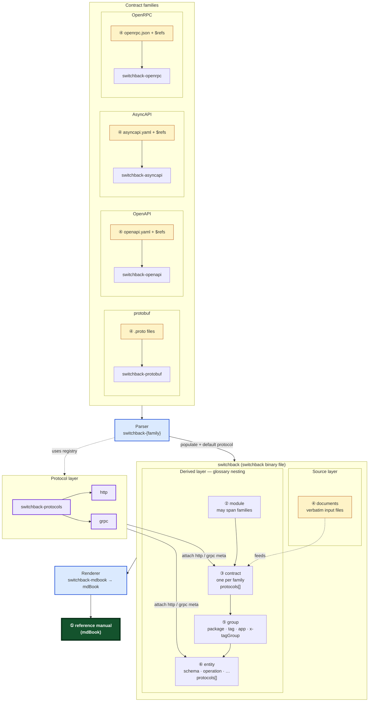

# Glossary

Terms used across the switchback-rs toolchain. Nesting levels run from the
whole manual down to individual renderable units; cross-cutting kinds describe
shapes and behavior inside a contract. **Protocol** semantics (HTTP method,
gRPC status, metadata, and future message bindings) are orthogonal to
[contract family](#contract-family) and documented under the **protocol** terms
below — not as a transport column on each family.

## Hierarchy

Each [contract family](#contract-family) groups its ④ [documents](#document)
and parser crate. A **parser** fills the [switchback](#switchback); a
**renderer** turns it into the ① [reference manual](#reference-manual) (mdBook).
[Protocol](#protocol) implementations in
[switchback-protocols](#switchback-protocols) attach transport-specific metadata
to ③ [contract](#contract) and ⑥ [entity](#entity) nodes during populate;
renderers decode those attachments instead of inferring invocation semantics
from display strings alone. Numbers match the [nesting levels](#nesting-levels)
table below.

## Nesting levels

| # | Term | Meaning | Example |
|---|---|---|---|
| 1 | [reference manual](#reference-manual) | The rendered artifact. Contains one or more modules. | the `api-book/` for "Acme Platform" |
| 2 | [module](#module) | A cohesive documentation unit that may span contract families. Becomes a top-level part. | "UserService" with a gRPC contract and an OpenAPI contract |
| 3 | [contract](#contract) | One family's description of a module. The merge of one or more documents. Belongs to one [contract family](#contract-family). Carries `protocols[]` for contract-level [protocol attachment](#protocol-attachment) (for example server/base URL on HTTP). | the protobuf IDL of UserService; the OpenAPI Description of UserService |
| 4 | [document](#document) | A single input file. | `user.proto`, `openapi.yaml`, `asyncapi.json` |
| 5 | [group](#group) | Intra-contract grouping: a protobuf package, an OpenAPI tag/`x-tagGroup`, an AsyncAPI application/tag. | `acme.user.v1`, the `admin` tag group |
| 6 | [entity](#entity) | An addressable renderable unit. Carries `protocols[]` on operation, response, and parameter bodies and on `ResponseRef` / `ParameterRef` attachments where the spec describes transport-specific facts. | a schema, an operation, a channel, a message, a parameter, a response, a security scheme |

The hand-maintained **Acme** corpora in
[`switchback-protobuf/tests/fixtures/proto/acme/`](../crates/switchback-protobuf/tests/fixtures/proto/acme/)
and
[`switchback-openapi/tests/fixtures/micro/acme/`](../crates/switchback-openapi/tests/fixtures/micro/acme/)
use matching version groups (`acme.example.v1`, `v2`, `v3alpha1`) for regression
and workspace examples (`acme-api`, `examples/reference-manual`).

## Cross-cutting kinds

| Term | Meaning |
|---|---|
| [schema](#schema) | A data-shape definition inside a contract (JSON Schema object, protobuf message/enum shape). Never used for the whole document. |
| [operation](#operation) | The family-defined unit of behavior (gRPC method, HTTP operation, AsyncAPI operation, JSON-RPC method). Invocation semantics — HTTP method and path, gRPC streaming shape, future message bindings — come from the attached [protocol](#protocol), not from parsing `OperationBody.signature` alone. |
| [component](#component) | A named, reusable entity declared once in a contract and referenced by name wherever it is reused. OpenAPI, AsyncAPI, and OpenRPC store components under a `components` object and reference them with `$ref`; protobuf has no `components` object and instead references top-level messages, enums, and services by fully-qualified name. A component is always an entity; an entity is a component only if it is named and reused by reference. |

## Terms

### anchor

A byte span into a specific prose field (`doc`, `fence_body`, or a named body
field) of an [entity](#entity). Part of an [intra-link](#intra-link); lets a
[renderer](#renderer) splice a resolved link without re-parsing the prose.

### companion

A markdown file discovered beside contract inputs and copied verbatim into the
reference manual. Companion discovery and placement rules are owned by each
[contract family](#contract-family) via its companion strategy. On the wire,
each companion stores `title`, `source_dir`, and `stem` nav metadata (see
[ADR 0009](https://github.com/canardleteer/switchback-rs/blob/main/docs/adr/0009-companion-nav-metadata-on-wire-in-switchback-traits.md))
so [renderers](#renderer) can build navigation without re-parsing companion
bytes or re-walking source trees. How each target format uses those fields (for
example mdBook `SUMMARY.md` nesting) is renderer-specific.

### component

See the [cross-cutting kinds](#cross-cutting-kinds) table.

### contract

One [contract family](#contract-family)'s description of a service or
application. A contract may span several input [documents](#document) (for
example an `openapi.yaml` and the files it `$ref`s). The term is deliberately
not *schema*, because JSON Schema definitions inside OpenAPI and AsyncAPI are
already called schemas, and the documents themselves are more than schemas.
Contract-level [protocol attachments](#protocol-attachment) (for example
`HttpContractMeta` or `GrpcContractMeta`) live in `protocols[]` on the contract
node.

### contract family

A specification family whose documents parsers understand: Protobuf, OpenAPI,
AsyncAPI, OpenRPC, or a JSON Schema catalog. Each family has one
`ContractFamily` trait impl (identity, defaults, categories, link syntax) and
one `Contract` trait impl per loaded instance. Each family also declares which
[protocols](#protocol) it may emit via
[contract family protocol binding](#contract-family-protocol-binding).

### contract family protocol binding

The `ContractFamily::supported_protocols` and `ContractFamily::default_protocol`
methods that declare which [protocol](#protocol) slugs a family may attach
during populate and which protocol is the default for that family (for example
OpenAPI → `http`, Protobuf → `grpc`).

### derived layer

The resolved `ReferenceManual` / `Module` / `Contract` / `Group` / `Entity`
tree inside a [switchback](#switchback), with `$ref`s already resolved into
structural cross-references. [Renderers](#renderer) consume the derived layer.
[Protocol attachments](#protocol-attachment) on contract and entity nodes are
part of the derived layer once populate has run.

### document

A single input file: `user.proto`, `openapi.yaml`, `asyncapi.json`, and so on.
One or more documents merge into a [contract](#contract).

### entity

An addressable renderable unit inside a [group](#group): a schema, an
operation, a channel, a message, a parameter, a response, a security scheme, and
so on. Each [contract family](#contract-family) defines its own typed
[entity category](#entity-category) enum. Entity bodies and inline refs
(`ResponseRef`, `ParameterRef`) carry `protocols[]` when the input spec
describes transport-specific facts (method, path, status, headers, metadata,
streaming, errors).

### entity category

A family-owned label for an [entity](#entity)'s kind (`schema`, `operation`,
`channel`, …). Implemented as the `EntityCategory` trait in
`switchback-traits`; the core never holds a closed enum of categories.

### envelope

The shared API-description object model lifted into `switchback-jsonschema`:
`info`, `servers`, `components`, `security`, `tags`, `externalDocs`, and
related fields common to OpenAPI, AsyncAPI, and OpenRPC documents.

### generic category

Renderer-known entity categories (`Schema`, `Operation`, `Service`, `Generic`)
that `EntityCategory::to_generic` maps family-specific categories onto.
Categories with no mapping render through the generic fallback.

### group

The intra-[contract](#contract) grouping unit: a protobuf package, an OpenAPI
tag or `x-tagGroup`, an AsyncAPI application or tag.

### gRPC call metadata

Transport key/value pairs sent with an RPC per the
[gRPC protocol](https://github.com/grpc/grpc/blob/master/doc/PROTOCOL-GRPC.md),
distinct from protobuf **message** fields named `metadata` (payload data on
request/response messages). Authors declare call metadata keys on RPCs via the
`switchback_rpc_metadata` extension on `google.protobuf.MethodOptions` (see
[ADR 0012](https://github.com/canardleteer/switchback-rs/blob/main/docs/adr/0012-http-streaming-inference-and-grpc-metadata-from-protobuf-options.md)).
Populate attaches each key as a `ParameterRef` with `location: "metadata"` and
`GrpcMetadataMeta` in `protocols[]`.

### GrpcErrorMeta

A gRPC [protocol](#protocol)-package message describing fault documentation: RPC
status code, message, and structured details aligned with
[`google.rpc.Status`](https://github.com/googleapis/googleapis/blob/master/google/rpc/status.proto).
Encoded as the `error` arm of `GrpcPayload`. Distinct from success
`GrpcStatusMeta`.

### HTTP header vs gRPC metadata

Distinct field-carrier concepts that must not be conflated in populate or
render. HTTP uses **headers** (and trailers, cookies) per
[RFC 9110](https://www.rfc-editor.org/rfc/rfc9110.html) and OpenAPI parameter
`in` values; gRPC uses **metadata** (initial and trailing) per the
[gRPC protocol](https://github.com/grpc/grpc/blob/master/doc/PROTOCOL-GRPC.md).
Populate labels each carrier with the correct [protocol](#protocol) meta type
(`HttpParameterMeta` vs [GrpcMetadataMeta](#grpc-call-metadata)). See
[gRPC call metadata](#grpc-call-metadata) for how protobuf RPCs declare metadata
keys.

### HTTP streaming flags

`HttpOperationMeta.request_streaming` and `HttpOperationMeta.response_streaming`
on the `http` [protocol attachment](#protocol-attachment). OpenAPI populate
infers them from documented `requestBody` / `responses` content media types (see
[ADR 0012](https://github.com/canardleteer/switchback-rs/blob/main/docs/adr/0012-http-streaming-inference-and-grpc-metadata-from-protobuf-options.md));
OpenAPI has no native streaming fields on operations.

### HttpErrorMeta

An HTTP [protocol](#protocol)-package message describing fault documentation:
status code, optional
[Problem Details](https://www.rfc-editor.org/rfc/rfc9457.html) fields, and error
response headers. Encoded as the `error` arm of `HttpPayload`. Distinct from
success `HttpResponseMeta`.

### intra-link

A cross-reference an author writes in prose (inside a `description`, fenced
snippet, or comment). Distinct from structural `Reference`s in `Entity.refs`,
which come from the contract's schema shape (`$ref`, protobuf field types).
Intra-links are pre-resolved at ingest time; [renderers](#renderer) format them
for the output target rather than re-deriving the target.

### link extractor

The `LinkExtractor` trait: one impl per [contract family](#contract-family).
Walks an entity's prose fields, finds author-syntax links, and emits resolved
[intra-links](#intra-link) against the whole manual's address space.

### link formatter

The `LinkFormatter` trait: turns a resolved intra-link target into a concrete
string for a [renderer](#renderer)'s output format (markdown relative link, HTML
URL, JSON for IDE plugins, and so on).

### module

A cohesive documentation unit that may span
[contract families](#contract-family). A module becomes a top-level part in a
[reference manual](#reference-manual). Described explicitly by a
[module manifest](#module-manifest) or synthesized implicitly when a single
contract is presented alone.

### module manifest

A `module.yaml` file beside the contracts that names the module, its overview,
and the contracts that belong to it. Parsed on the parser side before the
[switchback](#switchback) is frozen; recorded in the switchback [source
layer](#source-layer) so the manual is reproducible.

MVP assembly (OpenAPI + protobuf in one module) is demonstrated by
[`examples/reference-manual/`](../examples/reference-manual/) using
[`switchback-assemble`](../crates/switchback-assemble/); see
[ADR 0014](adr/0014-multi-contract-reference-manual-assembly.md). Full
`module.yaml` parsing inside every family parser remains deferred.

### operation

See the [cross-cutting kinds](#cross-cutting-kinds) table. On the wire,
`OperationBody.signature` remains a human-facing display string (for example
`GET /pets` or `EchoUnary (…) returns (…)`), populated from the default
[protocol](#protocol) implementation for consistency. Structured invocation
facts live in [protocol attachments](#protocol-attachment) on the operation
node (HTTP method/path and [HTTP streaming flags](#http-streaming-flags); gRPC
streaming shape and [gRPC call metadata](#grpc-call-metadata) on parameters).

### parser

A `switchback-{family}` crate that turns a [contract](#contract) into a
[switchback](#switchback). Implements `ContractFamily`, `Contract`, and
`LinkExtractor`. During populate, attaches [protocol](#protocol) metadata via
the family default protocol and `switchback-protocols` registry.
Always emits a [switchback binary file](#switchback-binary-file) unless
`--no-switchback` is set.

### protocol

Transport and invocation semantics orthogonal to
[contract family](#contract-family). Identified by a stable slug (`http`,
`grpc`, or a custom id such as `acme/kafka`). The `http` protocol covers raw
HTTP / OpenAPI operations (methods, paths, status codes, headers). The `grpc`
protocol covers RPC semantics (status codes, metadata, streaming) — not HTTP/2
specifically; gRPC may run in-process or over other transports. Custom protocols
register via `ProtocolRegistry` without editing `switchback-protocols`.

### protocol attachment

`ProtocolAttachment { protocol_id, payload }` stored on [contract](#contract)
and [entity](#entity) nodes in traits and on the wire. The `payload` bytes
encode exactly one arm of a protocol-specific top-level oneof (for example
`HttpPayload` or `GrpcPayload` in package
`canardleteer.switchback.protocol.http.v1alpha1`). Multiple bindings on one
operation use `repeated ProtocolAttachment` (motivating case: AsyncAPI
kafka + amqp).

| IR node | Typical `http` arm | Typical `grpc` arm |
| --- | --- | --- |
| `Contract` | `HttpContractMeta` | `GrpcContractMeta` |
| `OperationBody` | `HttpOperationMeta` | `GrpcOperationMeta` |
| `ResponseRef` / `ResponseBody` | `HttpResponseMeta` / `HttpErrorMeta` | `GrpcStatusMeta` / `GrpcErrorMeta` |
| `ParameterRef` / `ParameterBody` | `HttpParameterMeta` | `GrpcMetadataMeta` |
| `RequestBodyBody` | (when transport-specific) | — |

Decode: read `protocol_id`, deserialize `payload` as the matching protocol
package oneof, inspect the arm. Matrix and steps:
[ADR 0011](https://github.com/canardleteer/switchback-rs/blob/main/docs/adr/0011-protocol-layer-and-contract-family-binding.md).
gRPC call metadata authoring uses the `switchback_rpc_metadata` protobuf
extension — see
[ADR 0012](https://github.com/canardleteer/switchback-rs/blob/main/docs/adr/0012-http-streaming-inference-and-grpc-metadata-from-protobuf-options.md)
and [gRPC call metadata](#grpc-call-metadata).

### reference manual

The rendered artifact the toolchain produces (for example, an mdBook). Contains
one or more [modules](#module). The term is output-format neutral.

### renderer

A `switchback-{target}` crate that turns a [switchback](#switchback) into a
target format. Implements the `Renderer` trait. May run standalone on a
switchback binary file or be invoked in-process by a parser (`--render mdbook`).
Decodes [protocol attachments](#protocol-attachment) via `ProtocolRegistry` for
operation badges, method/path lines, RPC streaming markers, and
[ResponseSeverity](#responseseverity) labels rather than re-parsing
`OperationBody.signature`.

### ResponseSeverity

A cross-protocol outcome class on `ResponseRef` and `ResponseBody`. Each
[protocol](#protocol) maps family-specific status and error keys into
`ResponseSeverity` at populate time via `ResponseProtocol` / `ErrorProtocol`;
renderers read the entity field, not ad hoc status-class helpers in family
crates.

### schema

See the [cross-cutting kinds](#cross-cutting-kinds) table.

### seam

`switchback-traits`: the core crate between parsers and renderers. Owns the
trait spine, the in-memory model, format-agnostic helpers, and the
`SwitchbackCodec` trait. Knows nothing about any contract family, output
format, or serialization format. Protocol-specific behavior lives in
[switchback-protocols](#switchback-protocols) and family populate code that
calls into it.

### source layer

The `repeated Document sources` inside a [switchback](#switchback). Each
`Document` carries raw as-authored bytes, a media type, and a
[SourceRef](#sourceref). Keeps the switchback lossless: anything not modeled in
the [derived layer](#derived-layer) remains recoverable from the source bytes.

### SourceRef

Provenance for a [document](#document) in the [source layer](#source-layer):
`{ uri, commit, content_hash }`. The content hash (SHA-256, hex) makes
"stable" verifiable so consumers can detect drift after the switchback was
built.

### structural reference

A cross-reference encoded in an [entity](#entity)'s schema shape (a `$ref` JSON
Pointer, a protobuf fully-qualified type name in a field). Lands in
`Entity.refs` and is distinct from an [intra-link](#intra-link).

### switchback

The versioned, lossless intermediate representation between [parsers](#parser)
and [renderers](#renderer). Every parser emits it; every renderer reads it. The
name is the metaphor of a hairpin turn on a mountain trail: climb from source
[contracts](#contract) through parsing, pivot at the switchback, then either
return to verbatim source [documents](#document) or continue into any rendered
form.

### switchback binary file

The canonical serialized form of a [switchback](#switchback), produced by a
`SwitchbackCodec` implementation (for example `switchback-codec-pb`).
Deterministic, cacheable, and the only artifact both parser and renderer sides
must agree on.

### switchback-protocols

The built-in [protocol](#protocol) implementations (`http`, `grpc`) plus
`ProtocolRegistry` for encode/decode of
[protocol attachment](#protocol-attachment) payloads. Extensible: custom
protocols register in downstream crates without editing this crate's source.

### SwitchbackCodec

The serialize/deserialize trait for a [switchback](#switchback).
`switchback-codec-pb` implements it as the reference binary codec using types
compiled from
`crates/switchback-codec-pb/proto/canardleteer/switchback/v1alpha1/switchback.proto`
(`canardleteer.switchback.v1alpha1`; repo-root `proto/` symlinks to this tree).
[Protocol attachment](#protocol-attachment) envelopes round-trip on the core
convert path; built-in payload schemas live in separate protocol packages.

## Vocabulary by contract family

How the nesting and cross-cutting terms map onto each supported family:

| Concept | protobuf | OpenAPI | AsyncAPI | OpenRPC |
|---|---|---|---|---|
| reference manual | the rendered manual | the rendered manual | the rendered manual | the rendered manual |
| module | the service the `.proto` set describes | the service the OpenAPI Description describes | the application | the service the OpenRPC document describes |
| contract | the `.proto` file set (compiled together) | OpenAPI Description (entry doc + `$ref`d files) | AsyncAPI document (entry doc + `$ref`d files) | OpenRPC document (entry doc + `$ref`d files) |
| document | one `.proto` file | one `openapi.yaml`/`.json` or referenced file | one `asyncapi.yaml`/`.json` or referenced file | one `openrpc.json`/`.yaml` or referenced file |
| group | protobuf package | tag / `x-tagGroup` | application `id` / tag | `x-tagGroup` |
| operation | service method | HTTP operation | operation (send/receive) | method |
| behavior surface | service | paths + webhooks | channels + operations | methods |
| data shape | message / enum | Schema Object | Schema Object / Multi-Format Schema | Content Descriptor |
| component (reusable) | top-level message/enum/service by FQN | `components.*` by `$ref` | `components.*` by `$ref` | `components.*` by `$ref` |
| reference | fully-qualified name | `$ref` JSON Pointer | `$ref` JSON Pointer | `$ref` JSON Pointer |
| default protocol(s) | [`grpc`](#protocol) | [`http`](#protocol) | multi-binding via `repeated` [protocol attachments](#protocol-attachment) when AsyncAPI populate lands *(stub today)* | none *(stub)* |
| validation hook | Protovalidate (CEL) | JSON Schema + `--validate` | JSON Schema + `--validate` | JSON Schema + `--validate` |
